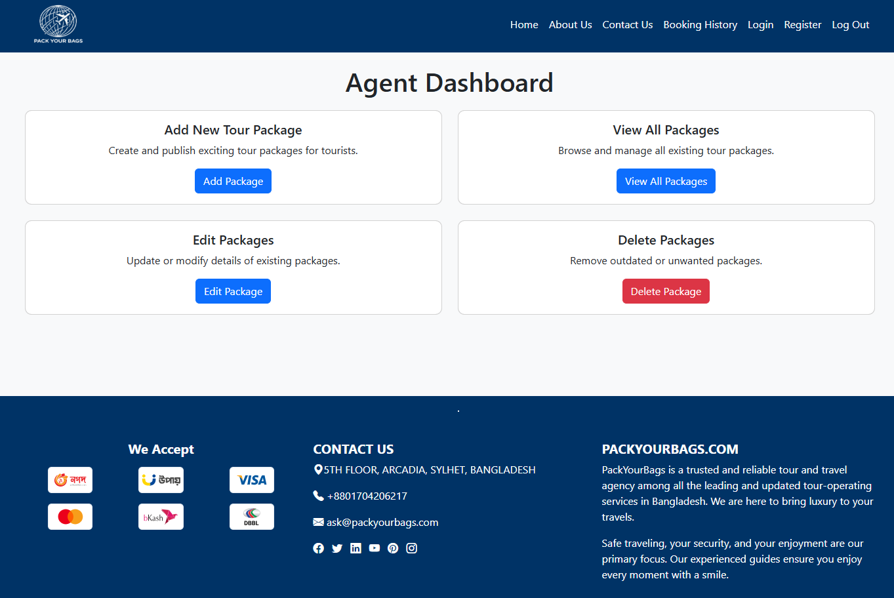
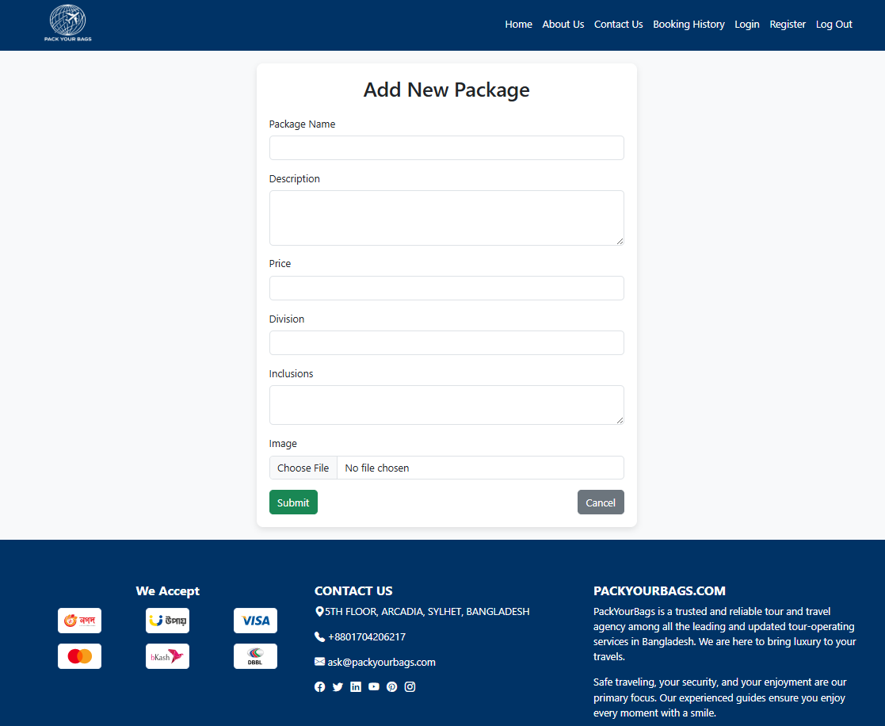
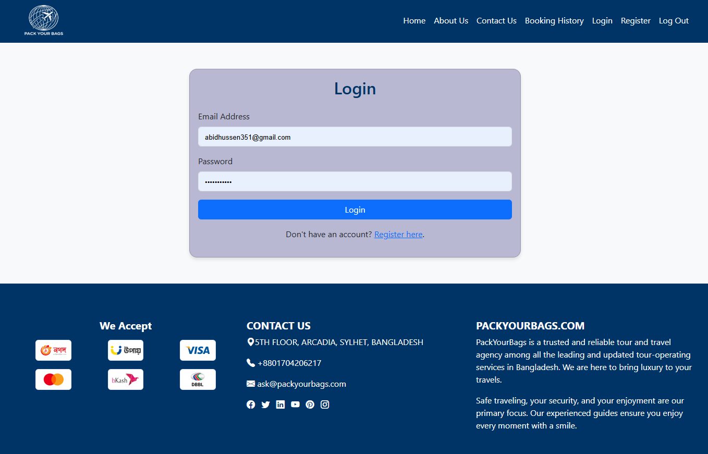
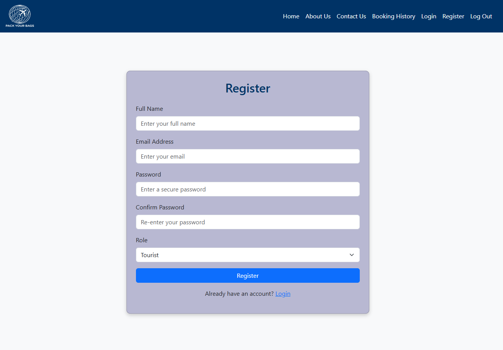
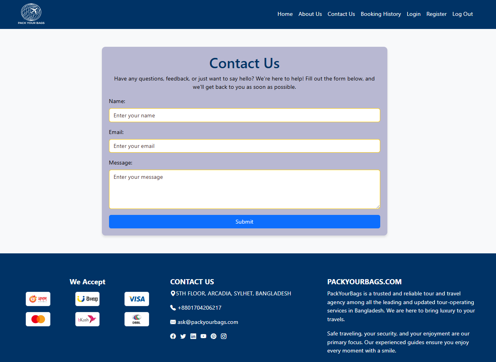
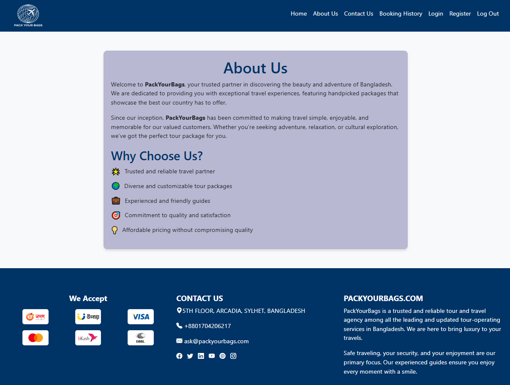

## PackYourBags

**A Travel Booking Platform for Exploring Tour Packages Across Bangladesh**  
A full-stack web application that allows users to browse, search, and manage travel packages with a clean interface for both tourists and travel agents.

---

### 📖 Table of Contents

1. [Overview](#-overview)  
2. [Features](#-features)  
3. [Tech Stack](#-tech-stack)  
4. [Screenshots](#-screenshots)  
5. [Usage](#-usage)  
6. [Project Structure](#-project-structure)  
7. [Limitations & Future Work](#-limitations--future-work)  
8. [Author](#-author)  

---

### 🌟 Overview

**PackYourBags** is a travel booking system designed to connect tourists with verified travel agents. The site features a package management dashboard for agents and a browsable interface for tourists, enabling efficient exploration, management, and searching of available travel packages based on geographic divisions.

---

### 🚀 Features

- 🔐 **User Registration & Login**  
  - Users register as **Tourist** or **Agent**  
  - Email-password authentication for login

- 🧳 **Tour Package Management**  
  - Add, edit, delete, and view packages with price, division, and images  
  - Tabular interface for managing packages

- 📍 **Division-Based Filtering**  
  - Tourists can filter by location: Dhaka, Sylhet, Chattogram, etc.

- 📄 **Detailed Package View**  
  - Each package includes name, description, image, and price

- 🔎 **Search Functionality**  
  - Search by package name or filter by division

- 👥 **Role-Based Access**  
  - Tourist: can browse, view, and search  
  - Agent: can manage packages

- 📷 **Image Upload Support**  
  - Agents can upload photos when adding new packages

- 📁 **Organized File Structure**  
  - Code separated into forms, actions, views, and DB connectors

---

### 🛠 Tech Stack

- **Frontend:** HTML, CSS, JavaScript  
- **Backend:** PHP  
- **Database:** MySQL  
- **Architecture:** Procedural PHP with modular file separation

---

### 📸 Screenshots

#### 🏖️ Homepage (Tourist View)


#### 🧑‍💼 Homepage (Agent View)


#### ➕ Add Package Page


#### 🔐 Login Page


#### 📝 Registration Page


#### 📩 Contact Us Page


#### ℹ️ About Us Page


---

### ⚙️ Usage

1. Clone the repository and host it locally using XAMPP/LAMP.
2. Import the SQL file into your MySQL server.
3. Start the Apache server and open the app in your browser.
4. Register as an **Agent** to add/edit/delete packages.
5. Register as a **Tourist** to explore and search travel packages.

---

### 📁 Project Structure

```
PackYourBags/
├── about.php                      # About page
├── add_packages.php              # Form to add new tour packages
├── add_package_action.php        # Logic to insert package into DB
├── connect_database.php          # Central DB connection script
├── contact.php                   # Contact form page
├── delete_package.php            # Confirmation for deleting a package
├── delete_package_action.php     # Logic to delete package
├── division_packages.php         # Show packages filtered by division
├── edit_package.php              # Combined edit handler (optional use)
├── edit_package_form.php         # Form to edit existing package
├── edit_package_action.php       # Logic to update package in DB
├── homepage_agent.php            # Agent dashboard to manage packages
├── homepage_tourist.php          # Tourist homepage to browse packages
├── login.php                     # Login form
├── process_login.php             # Login logic
├── registration.php              # Registration form
├── process_registration.php      # Logic to create new user (tourist/agent)
├── package_details.php           # View full details of a package
├── process_search.php            # Backend search handler
├── view_all_packages.php         # Full list of packages for browsing
├── picture/                      # Contains uploaded package images
├── uploads/                      # (Optional duplicate image folder)
```

---

### ⚠️ Limitations & Future Work

- ❌ **No Password Hashing** — passwords stored in plain text  
- ❌ **No Session Management** — lacks secure login persistence  
- ❌ **Basic Search Only** — no sorting, suggestions, or full-text search  
- ❌ **No Validation on File Uploads**  
- ❌ **Not Mobile-Responsive**  
- ❌ **No Order History or Booking System**

**Planned Enhancements:**

- Secure authentication with session management & password hashing  
- Admin dashboard for tourists (e.g., favorites, history)  
- Booking flow and order confirmation  
- Responsive redesign with mobile support  
- Integration of Google Maps & reviews

---

### 👨‍💻 Author

- **Abid Hussen**  
  B.Sc. in CSE, Leading University  
  📧 [abidhussen351@gmail.com](mailto:abidhussen351@gmail.com)  
  🌐 [GitHub](https://github.com/AbiDHussen)
